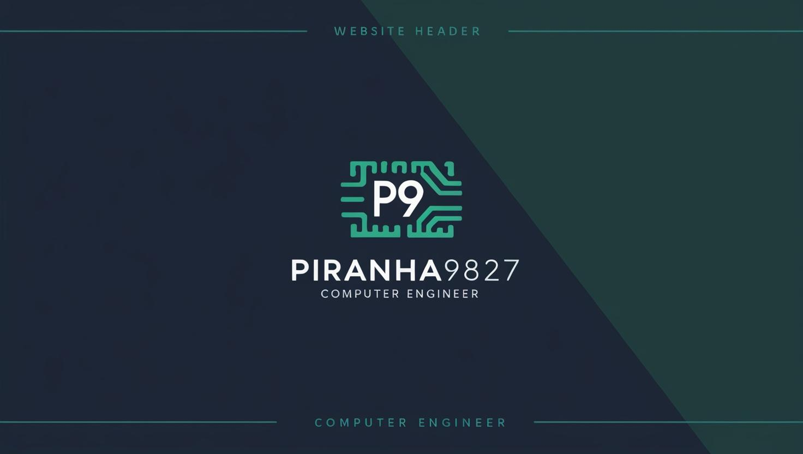

  

# Hi there, I'm Giuseppe 👋

## I am a Full- Stack Developer 💻 
---
I am passionate about technology and programming, with a particular interest in artificial intelligence, remote sensing, data science, computer vision, modelling and simulation, robotics and computer graphics etc. I enjoy learning new technologies and putting them into practice through personal projects and open-source collaborations.

Core Skills
Programming Languages: C/C++, Java, Android, C#, SQL, Fortran77, Python, JavaScript, Matlab
Frameworks and Libraries: OpenCV, YOLO, React, TensorFlow, Numpy, Pandas. 
Tools and Technologies: Git, Comsol, Ansys, Matlab, Cybersecurity

### 🛠️ I'm currently working on

- My old projects  
- Remote Sensing App   
- Computer Vision tool
- My skill

---

### 🌱 I'm currently learning

- ⚛️ C/C++
- 🔥 Python  
- 🧠 Google Earth Engine  
- 💅 Gis Software

### 🤝 Connect with me:

)  

💬 If you have any question/feedback, please do not hesitate to reach out to me!

